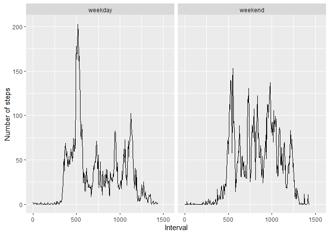

## Loading and preprocessing the data
First, we import the needed libraries. After that, we load the raw data into a data frame. Furthermore we create a second data frame by dropping the missing values.

```r
library(dplyr)
```

```
## 
## Attache Paket: 'dplyr'
```

```
## Die folgenden Objekte sind maskiert von 'package:stats':
## 
##     filter, lag
```

```
## Die folgenden Objekte sind maskiert von 'package:base':
## 
##     intersect, setdiff, setequal, union
```

```r
library(tidyr)
library(ggplot2)
raw_df <- read.csv(unz("activity.zip","activity.csv"))
df <- na.omit(raw_df)
```


## What is mean total number of steps taken per day?
In order to answer the question, we first group the data frame by the date column so that we can compute the total sum of all steps per day. The frequency of the total number of steps is shown in the histogram.

```r
grouped_df <- group_by(df,date)
total_steps <- summarise(grouped_df,total=sum(steps))
hist(
  total_steps$total,
  breaks=50,
  main="Frequency for total steps per day",
  xlab="Total steps"
)
```

<!-- -->

Finally, we compute the mean and median of the total number of steps per day across all days.

```r
cat(c("Mean: ",mean(total_steps$total)))
```

```
## Mean:  10766.1886792453
```

```r
cat(c("Median: ",median(total_steps$total)))
```

```
## Median:  10765
```

## What is the average daily activity pattern?
Again, we group the data frame but this time, we group it by the interval and compute the mean of the number of steps across all days. The interval code is then converted in the total number of minutes.

```r
grouped_df <- group_by(df,interval)
average_steps <- summarise(grouped_df,average=mean(steps))
average_steps$interval <- 60*(average_steps$interval%/%100)+average_steps$interval%%100
plot(
  average_steps,
  type="l",
  main = "Number of average Steps along the day",
  xlab="Minutes",
  ylab="Number of average Steps"
)
```

<!-- -->

Finally, we locate the interval with the maximum average number of steps across all days.

```r
max_index <- average_steps[which.max(average_steps$average),][[1,1]]
hour <- max_index%/%60
minute <- max_index%%60
cat(c("5-Minute interval with Maximum: ",hour,":",minute),sep="")
```

```
## 5-Minute interval with Maximum: 8:35
```

## Imputing missing values
Now, we consider the raw data. We take a look at the number of missing values.

```r
cat(c("Number of rows with NA's:",length(raw_df[is.na(raw_df)])))
```

```
## Number of rows with NA's: 2304
```
Next we replace the missing values with zeros. As before we plot the total number of steps per day as a histogram and compute after the mean and median across all days.

```r
no_na_df <- replace_na(raw_df,list(steps=0))
# Create the histogram
grouped_df <- group_by(no_na_df,date)
total_steps <- summarise(grouped_df,total=sum(steps))
hist(
  total_steps$total,
  breaks=50,
  main="Frequency for total steps per day",
  xlab="Total steps"
)
```

<!-- -->

```r
cat(c("Mean: ",mean(total_steps$total)))
```

```
## Mean:  9354.22950819672
```

```r
cat(c("Median: ",median(total_steps$total)))
```

```
## Median:  10395
```
In the first part of the assignment we computed as mean 10766.1886792453 and median 10765. Hence, we see that keeping the missing values decreases the mean and median.

## Are there differences in activity patterns between weekdays and weekends?
For the analysis we first convert the date column to Date type, so that we can apply the weekdays() function to it. After that we group the days into "weekday" and "weekend". According to this two labels we compute the average number of steps for each interval across all days.

```r
Sys.setlocale("LC_TIME", "English")
```

```
## [1] "English_United States.1252"
```

```r
no_na_df$date <- as.Date(no_na_df$date)
no_na_df$weekday <- weekdays(no_na_df$date,abbreviate = TRUE)
weekday_list <- c("Mon","Tue","Wed","Thu","Fri")
weekend_list <- c("Sat","Sun")
for (day in weekday_list){
  no_na_df$weekday[no_na_df$weekday==day] <- "weekday"
}
for (day in weekend_list){
  no_na_df$weekday[no_na_df$weekday==day] <- "weekend"
}
no_na_df$weekday <- as.factor(no_na_df$weekday)

grouped_df <- group_by(no_na_df,interval,weekday)
average_steps <- summarise(grouped_df,average=mean(steps))
```

```
## `summarise()` has grouped output by 'interval'. You can override using the `.groups` argument.
```

```r
average_steps$interval <- 60*(average_steps$interval%/%100)+average_steps$interval%%100

qplot(
  interval,
  average,
  data=average_steps,
  geom="line",
  xlab = "Interval",
  ylab = "Number of steps",
  xlim = c(0,1550),
  facets = .~weekday
)
```

<!-- -->

The panel plot shows a clear difference in the average number of steps. We see that the frequency of steps in the morning is much lower on the weekends. On the rest of the day the extrema are higher on the weekend than on the weekdays.
